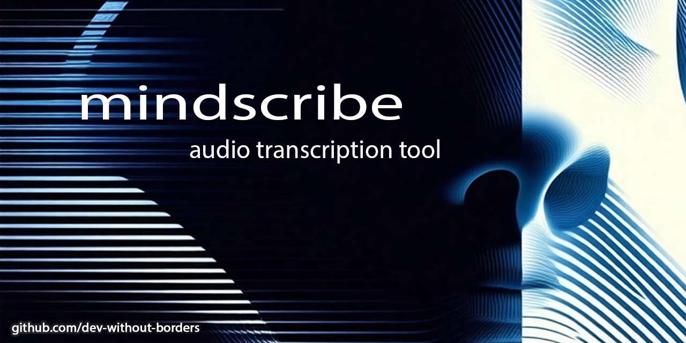
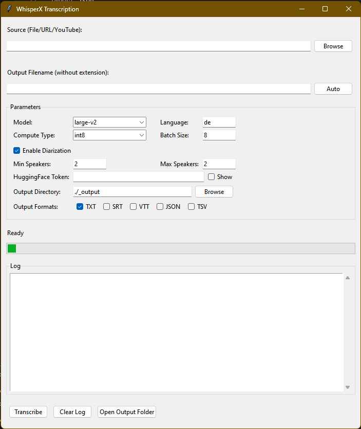

# mindscribe

## *Audio Transcription GUI based on WhisperX*

[](https://opensource.org/licenses/MIT)
[](https://www.python.org/downloads/)
[](https://github.com/dev-without-borders/mindscribe/issues)
[](https://github.com/dev-without-borders/mindscribe/stargazers)

---

**A user-friendly and free GUI tool for high-precision audio transcription with WhisperX, optimized for ease-of-use and simple workflows.**

## ✨ **Features**

```markdown
- **🎯 Drag & Drop Support** – Simply drag files into the window
- **📁 Local or URL Source** – Transcribe local files or from online URL
- **🎬 YouTube Integration** – Direct transcription from YouTube videos
- **📝 Multiple Formats** – Export as TXT, SRT, VTT, or JSON
- **🌍 Auto Language Detection** – Detects language automatically
- **🔄 Speaker Diarization** – Distinguishes between different speakers
- **🛡️ Local & private** – Everything stays on your Machine
- **🚀 CUDA-Support** – much faster with NVIDIA-GPUs (optional but recommended)
```

**📋 Supported Formats (not all tested)**
**Input:**
   - **Audio**: .mp3, .wav, .m4a, .flac, .ogg, .aac, .wma
   - **Video**: .mp4, .avi, .mkv, .mov, .webm
   - **Streaming**: YouTube-URLs

**Output:**
   - **.txt** - Simple Text
   - **.srt** - Subtitles (with Timestamps)
   - **.vtt** - WebVTT Subtitles
   - **.json** - JSON with Metadata



## **Requirements**

- **Python 3.9+**
- Download ffmpeg [here](https://www.gyan.dev/ffmpeg/builds/ffmpeg-release-essentials.zip) (Windows version).

***For GPU-Support:***

- **NVIDIA GPU** (tested on 8GB VRAM with BatchSize=8 and int8) 
- **CUDA** (get it on [CUDA Platform for Accelerated Computing | NVIDIA Developer](https://developer.nvidia.com/cuda))
- **pytorch** that fits to your GPU (follow installation instructions on the [PyTorch website](https://pytorch.org/get-started/locally/))

***For Speaker Diarization:***

- To **Create Token** (free, just for intital model-download!) at https://huggingface.co/
    -> **Register or Log In**
    -> **Accept End User Agreement** on    
  
     [pyannote audio](https://github.com/pyannote/pyannote-audio)
     and
     [silero vad](https://github.com/snakers4/silero-vad)
  
    -> **Create Token**

---

## **Installation**

-> **Install Python 3.9+ FIRST**

***Automatic Installer***

1. **Download** the latest release of mindscribe from the [releases page](https://github.com/dev-without-borders/mindscribe/releases) and unzip it to a new directory of your choice.`

2. For GPU-acceleration with **CUDA download and install**

[Download CUDA](https://developer.nvidia.com/cuda)

3. **Download and copy ffmpeg.exe** to mindscribe-directory

[Download ffmpeg (Windows)](https://www.gyan.dev/ffmpeg/builds/ffmpeg-release-essentials.zip)

4. Run **SETUP.bat**. This script will install Python dependencies and set up the environment. 

5. **Follow Instructions**

6. From the mindscribe directory, **start the application** with:
   
   ```batch
   python mindscribe.py
   ```

***Manual Install***

1. Clone Repository or download
   
   ```batch
   git clone https://github.com/dev-without-borders/mindscribe.git
   cd mindscribe
   pip install -r requirements.txt
   ```

2. For GPU-acceleration with **CUDA download and install**

[Download CUDA](https://developer.nvidia.com/cuda)

3. **Download and copy ffmpeg.exe** to mindscribe-directory

[Download ffmpeg (Windows](https://www.gyan.dev/ffmpeg/builds/ffmpeg-release-essentials.zip)

4. Start with
   
   ```batch
   python mindscribe.py
   ```

---

## Quickstart

1. Choose local file, URL or Youtube link.
2. Choose or generate output file name.
3. Select settings to your needs.
4. Select output directory and format.
5. Click "Transcribe".

---

## Roadmap

- Batch Processing
- Voice Recording
- CLI Integration
- .md-Output for Obsidian
- Modularity
- Quick Infos for explanation
- Documentation

---

## 🛠️ Tech Stack

- **WhisperX** - State-of-the-art Speech Recognition
- **PyTorch** - Deep Learning Backend
- **tkinter** - Cross-platform GUI
- **yt-dlp** - YouTube Download
- **faster-whisper** - Optimized Inference

---

## Issues

Please report bugs or suggest features on GitHub Issues.

---

## 📜 License

MIT © 2025 [dev-without-borders](https://github.com/dev-without-borders)

---

## 🌟 Star History

[](https://star-history.com/#dev-without-borders/mindscribe&Date)